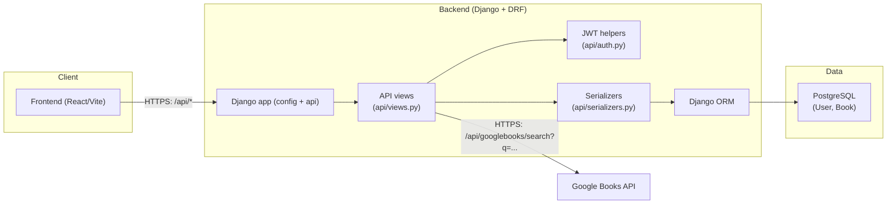

## System context

### Key URLs (from `api/urls.py`)

- `POST /api/users/register`
- `POST /api/users/login`
- `GET|POST /api/books`
- `PUT|DELETE /api/books/<pk>`
- `GET /api/googlebooks/search?q=...`

