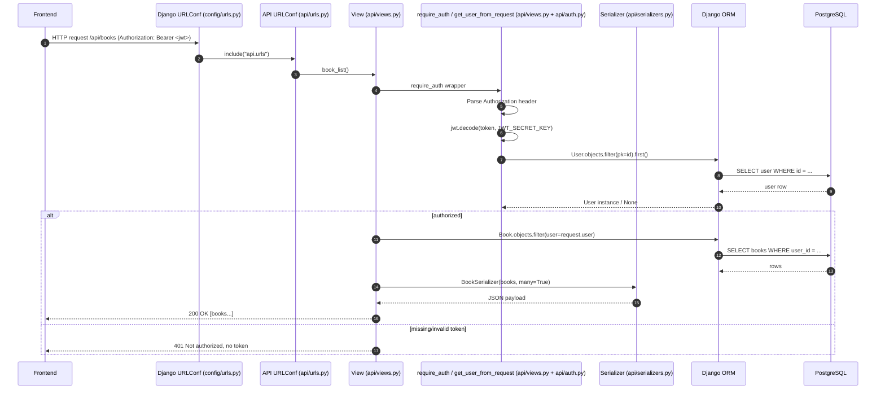

## Request lifecycle (routing → auth → DB)

### Where each step lives

- **Routing**: `config/urls.py` includes `api.urls` at `/api/`
- **Views**: `api/views.py`
- **Auth**: `require_auth()` in `api/views.py` + JWT decode in `api/auth.py`
- **Serialization**: `api/serializers.py`
- **Persistence**: `api/models.py` + Django ORM to PostgreSQL (`config/settings.py`)

